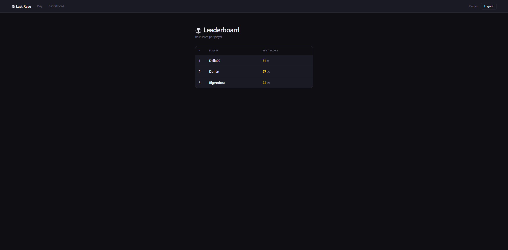
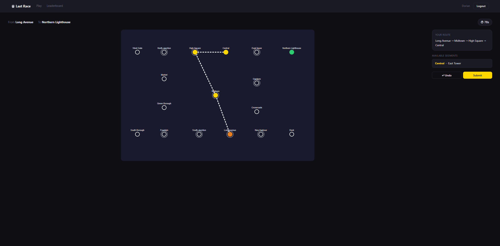

# Last Race
## Student: s347876 DESDERI LUCA 

## Server-side

### API Server

| Method | Endpoint | Auth | Description |
|--------|----------|------|-------------|
| `POST` | `/api/sessions` | Public | Login. Request body: `{ username, password }`. Returns the authenticated user object `{ id, username }`. |
| `GET` | `/api/sessions/current` | Public | Returns the currently authenticated user, or `401` if not logged in. |
| `DELETE` | `/api/sessions/current` | Logged in | Logout. Destroys the current session. |
| `GET` | `/api/network` | Logged in | Returns the full metro network: `{ lines, stations, segments }`. |
| `POST` | `/api/games` | Logged in | Starts a new game. The server randomly assigns a start and end station (minimum distance of 3 stops). Deletes any previously incomplete games for the user. Returns `{ gameId, startStation, endStation }`. |
| `POST` | `/api/games/:id/submit` | Logged in | Submits the planned route as an array of station IDs `{ route: [id, ...] }`. Validates the route, generates random events for each segment, saves the result, and returns `{ valid, score, steps }`. |
| `GET` | `/api/leaderboard` | Logged in | Returns the best score per user, ordered by score descending: `[{ id, username, best_score }]`. |

### Database Tables

* Table `users` - contains the registered users with their credentials (username and bcrypt-hashed password)
* Table `lines` - contains the metro lines of the network (name)
* Table `stations` - contains all the stations of the network (name)
* Table `line_stations` - contains the associations between lines and stations, including the position of each station along the line; used to derive valid segments and interchange stations
* Table `events` - contains the random events that can occur during a journey segment, each with a description and a coin effect (from -4 to +4)
* Table `games` - contains all the games played by registered users, including the assigned start and end stations, the final score, and the timestamps of creation and completion
* Table `game_steps` - contains the individual steps of each completed game, storing the from/to stations, the event that occurred, and the coin total after each step

---

## Client-side

### React Routes

| Route | Access | Description |
|-------|--------|-------------|
| `/` | Public | Home page with game instructions. Anonymous users see instructions only; logged-in users see a button to start playing. |
| `/login` | Public | Login form. Redirects to `/` on success. |
| `/play` | Logged in | The game page, managing all four game phases: Setup, Planning, Execution, and Result. |
| `/leaderboard` | Logged in | General ranking showing the best score per registered user. |

### React Components

* `App` - Root component. Holds the `user` state, checks the current session on mount via `useEffect`, and wraps all routes inside `UserContext.Provider`.
* `UserContext` - React context that provides `{ user, setUser }` to all components, avoiding prop drilling.
* `ProtectedRoute` - Wrapper component that redirects unauthenticated users to `/login`.
* `Navbar` - Top navigation bar. Shows Play and Leaderboard links when logged in, and handles logout.
* `NetworkMap` - SVG-based interactive metro map. Accepts props to control line visibility, highlight the player's route, mark start/end stations, and animate the execution step by step.
* `HomePage` - Displays game instructions. Shows a "Start Playing" or "Login to Play" button based on auth state.
* `LoginPage` - Login form with error handling.
* `GamePage` - Core game component managing the four phases (`setup`, `planning`, `execution`, `result`) via a `phase` state. Handles the 90-second countdown timer, segment selection, route submission, step-by-step execution animation, and event modals.
* `LeaderboardPage` - Fetches and displays the general ranking table.

---

## Screenshots

### Leaderboard
yet to had cause i want to make it more pretty

### During a game

---

## Users

| Username | Password |
|----------|----------|
| Dorian | password123 |
| Delia00 | secret456 |
| BigAndrea | aiueo789 |

## Use of AI Tools

Claude was used while working on this project for: 
  - Some minor clarification on the assignment.
  - Debuggin logic errors
  - Testing idea to check everything is working